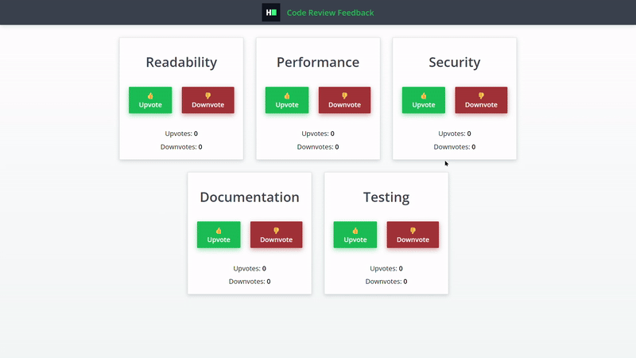

# Code Review Feedback

Your task is to create a React application called **"Code Review Feedback"** that tracks and manages feedback on various aspects of code quality. The component should have upvote and downvote functionality for each aspect, and it must meet all specified requirements.

## Detailed Requirements

1. The `CodeReviewFeedback` component displays five aspects: Readability, Performance, Security, Documentation, and Testing.
2. Each aspect has two buttons labeled **Upvote** and **Downvote** to allow users to vote.
3. The initial count for upvotes and downvotes for each aspect is set to zero.
4. Clicking the **Upvote** button should increment the upvote count for that aspect by 1.
5. Clicking the **Downvote** button should increment the downvote count for that aspect by 1.
6. Ensure the counts update in the UI immediately upon clicking.
7. The component should have a subtle animation when the voting count is updated to enhance the user experience.

## Sample Interaction

### Initial State

1. Display all five aspects with their respective upvote and downvote buttons.
2. Each aspect shows an initial count of 0 for upvotes and downvotes.

### User Action 1

1. User clicks **Upvote** for Readability.
2. The upvote count for Readability displays 1.

### User Action 2

1. User clicks **Downvote** for Performance.
2. The downvote count for Performance displays 1.

### User Action 3

1. User clicks **Upvote** for Security and Documentation multiple times.
2. The upvote count for Security displays 2 and Documentation displays 3.
