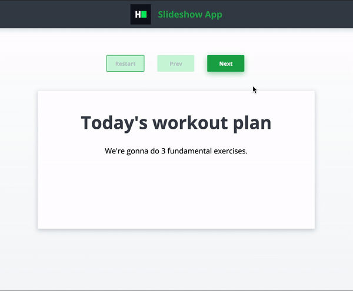

## Basic Slideshow - React Application Task

You are tasked with creating a simple React application called **"Basic Slideshow"** that displays a series of slides and allows users to navigate through them. The application requirements are detailed below, and the finished application must pass all of the unit tests.

## Detailed Requirements

1. The `Slides` component takes an array of slides as a prop. Each element of this array denotes a single slide and is an object with two properties: a string `title` and a string `text`.
2. When the application loads, the first slide must be rendered.
3. Clicking on the **"Next"** button shows the next slide. This button should be disabled when the current slide is the last one.
4. Clicking on the **"Prev"** button shows the previous slide. This button should be disabled when the current slide is the first one.
5. Clicking on the **"Restart"** button returns to the first slide. This button should be disabled when the current slide is the first one.
6. You can assume that the passed slides array contains at least one slide.

## Sample Interaction

### Initial State

- The first slide is displayed.
- The **"Prev"** and **"Restart"** buttons are disabled.

### User Action 1

- User clicks **"Next"** button.
- The next slide is displayed.
- The **"Prev"** and **"Restart"** buttons are enabled.

### User Action 2

- User clicks **"Prev"** button.
- The previous slide is displayed.
- The **"Prev"** button is disabled if the first slide is shown.

### User Action 3

- User clicks **"Restart"** button.
- The first slide is displayed.
- The **"Prev"** and **"Restart"** buttons are disabled.
